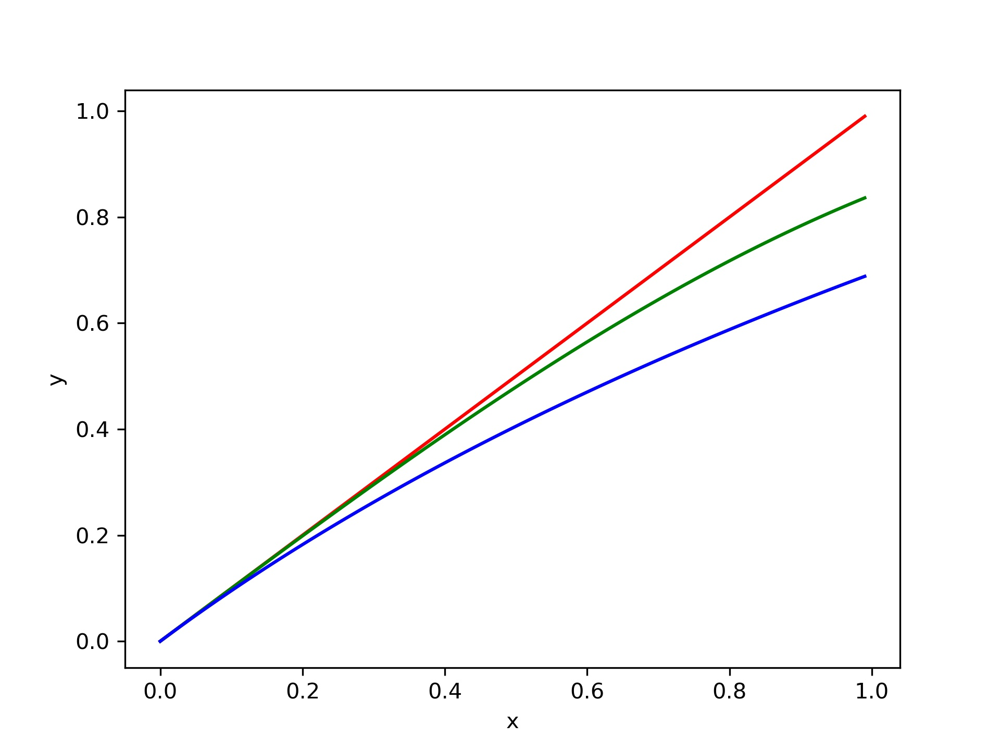
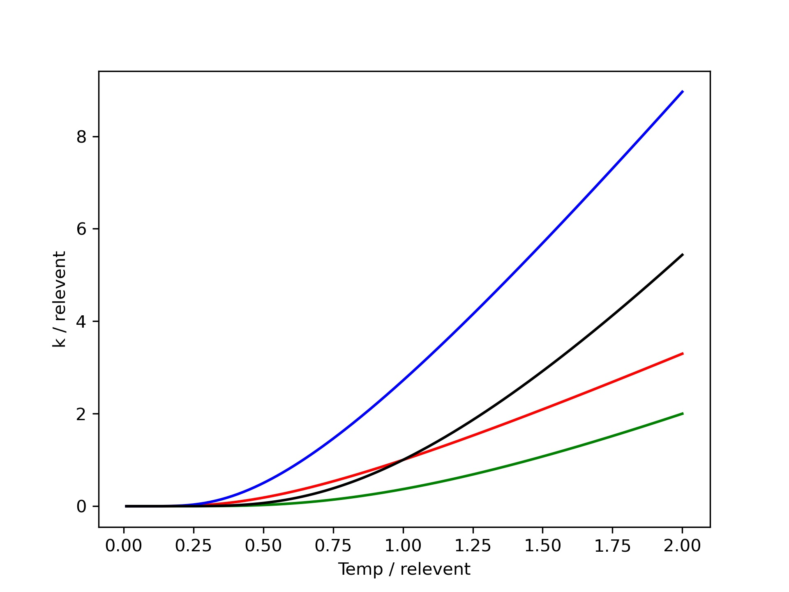

# Markdown 函数绘图脚本

通常在 Matlab 中生成数学函数需要由专业软件绘图后，以插图的形式贴入文档中。这个脚本的基本原理也是这样，不过可以实现在文档中使用 Python3 语法进行函数绘制。

这样可以在记笔记时先敲出方程，使用脚本课后整理，不用逐张插入，不容易对错位置。

**目录如下**

[TOC]

## 使用说明

首先写完 Markdown 文档，在 cmd/bash 中运行 Python3 脚本（源代码附在文末），根据提示输入文档路径，回车后即可自动生成全部图片。为了方便可以将脚本与文档放置于同一路径。

原理是 Python3 脚本将 Markdown 文件逐行读入，找到绘图的语法标志（```Python Grapher），将内部内容提取，组合成 Swap (Python) 临时文件，运行后产生图片并删除临时文件。这里的语法完全兼容Python3，要求有 numpy + matplotlib，并且已经默认导入。

请使用 UTF-8 编码，否则会乱码（无法解决时请不要使用中文）。

运行程序后除了会生成照片外，还会生成 finall_file.md，是去掉绘图代码的文件（源文件不做更改），并且保留了绘图的语法标志（方便为图片做显性注释），请根据需要决定是否删除。

## 插入图片的语法

```

```

## 绘图语法

```Python Grapher
# 函数定义
func = lambda x: np.log(x+1)
# 自定义域
x = np.array([0.01*i for i in range(100)])
# 绘制函数（可以罗列多个叠加）
plt.plot(x, x, 'r') 
plt.plot(x, np.sin(x), 'g')
plt.plot(x, func(x), 'b')
# 设置参数（请查看 matplotlib 手册）
plt.xlabel('x')
plt.ylabel('y')
# 保存图片
plt.savefig('test.jpg', dpi=300)
# 另外弹窗预览图片（可选，有的 Markdown 编译器不支持实时刷新，需要关掉预览窗口后才能生成其他图片）
plt.show()
# 结束本次绘制（必须包含该语句）
plt.close()
```

请注意，**必须加入**这条语句（每个图片的结束标记）
```Python
plt.close()
```

## 最终效果


---

# 项目实例（化学反应速率方程部分笔记节选）

对于总包反应，可以采用平衡态假设的方法来推导其速率方程：
$$ A \leftrightharpoons Int. \rightarrow P$$

$$r = \frac{d[P]}{dt} = k[Int.] = k K^{\neq} [A] = k^{\neq}A$$

$$k^{\neq} = \frac{k_B T}{h} e^{-\frac{\Delta_{r}^{\neq}H_{m}}{RT}} e^{\frac{\Delta_{r}^{\neq}S_{m}}{R}}$$

温度对反应的影响

构建一个简单的数学模型用以比较 $\Delta H^
{\neq}$，$\Delta S^{\neq}$ 对反应的影响。

$$k = T e^{-(\frac{H}{T} - S)}$$



> Fig-2 不同 $\Delta H^
{\neq}$，$\Delta S^{\neq}$ 对反应的影响。

```Python Grapher
k0 = lambda T: T*np.exp(-((1/T)-1))
k1 = lambda T: T*np.exp(-((2/T)-1))
k2 = lambda T: T*np.exp(-((1/T)-2))
k3 = lambda T: T*np.exp(-((2/T)-2))

T = np.array([0.01*(i+1) for i in range(200)])

plt.xlabel('Temp / relevent')
plt.ylabel('k / relevent')
plt.plot(T, k0(T), 'r')
plt.plot(T, k1(T), 'g')
plt.plot(T, k2(T), 'b')
plt.plot(T, k3(T), 'k')
plt.savefig('test2.jpg', dpi=300)
plt.close()
```

|颜色|$\Delta H^{\neq}$|$\Delta S^{\neq}$|解释|
|---|---|---|---|
|红|1|1|按照基准|
|绿|2|1|只增加活化焓，反应对温度更不敏感，绝对速率降低|
|蓝|1|2|只增加活化熵，反应对温度更敏感，绝对速率增加|
|黑|2|2|等比例增加活化焓与活化熵，在低温阶段焓效应做主导，高温阶段熵效应主导|
