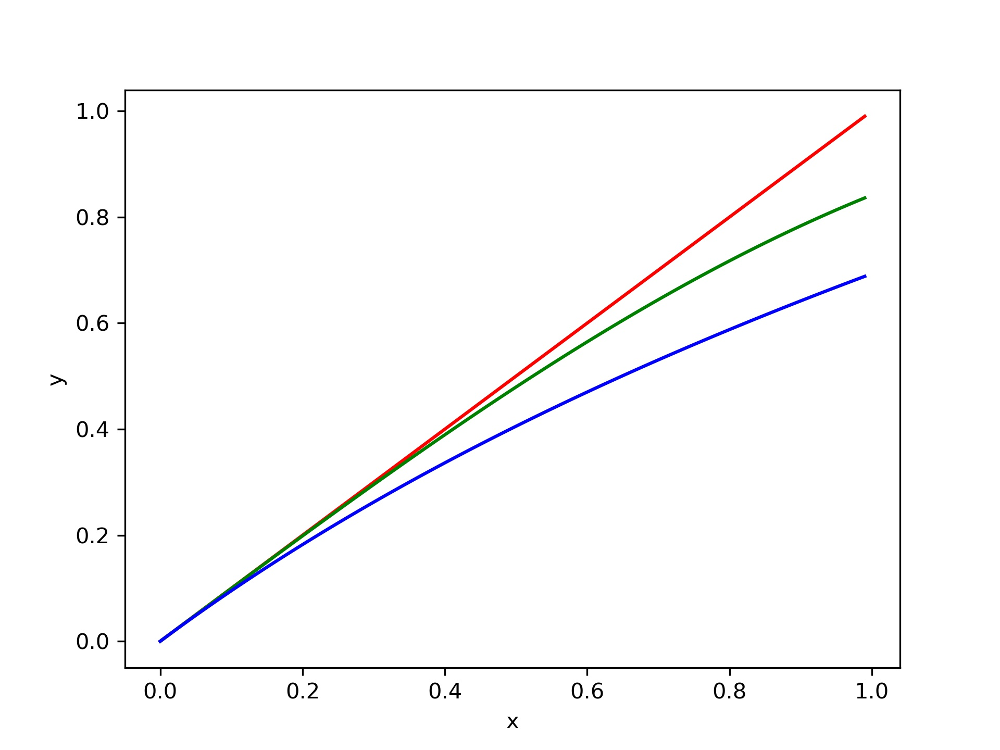

# Markdown 函数绘图脚本

通常在 Matlab 中生成数学函数需要由专业软件绘图后，以插图的形式贴入文档中。这个脚本的基本原理也是这样，不过可以实现在文档中使用 Python3 语法进行函数绘制。

这样可以在记笔记时先敲出方程，使用脚本课后整理，不用逐张插入，不容易对错位置。

**目录如下**

[TOC]

## 使用说明

首先写完 Markdown 文档，在 cmd/bash 中运行 Python3 脚本（源代码附在文末），根据提示输入文档路径，回车后即可自动生成全部图片。为了方便可以将脚本与文档放置于同一路径。

原理是 Python3 脚本将 Markdown 文件逐行读入，找到绘图的语法标志（```Python Grapher），将内部内容提取，组合成 Swap (Python) 临时文件，运行后产生图片并删除临时文件。这里的语法完全兼容Python3，要求有 numpy + matplotlib，并且已经默认导入。

请使用 UTF-8 编码，否则会乱码（无法解决时请不要使用中文）。

运行程序后除了会生成照片外，还会生成 finall_file.md，是去掉绘图代码的文件（源文件不做更改），并且保留了绘图的语法标志（方便为图片做显性注释），请根据需要决定是否删除。

## 插入图片的语法

```

```

## 绘图语法

```Python Grapher
```

请注意，**必须加入**这条语句（每个图片的结束标记）
```Python
plt.close()
```

## 最终效果



## 源代码

```Python
# initiating
import os
key_word = '```Python Grapher\n'
flag = 0
conter = 0

# get the .md file path (name)
file_path = input('Please scan in the file path:\n') 

# read .md file, and extract file into a list
with open(file_path, 'r', encoding='utf-8') as f:
    file = f.readlines()

# def. a swap_file(.py) list for generating photographs
swap_file = [
    'import matplotlib.pyplot as plt\n',
    'import numpy as np\n',
]

# def. a list of finall_file(.md)
finall_file = []

# core code for for generating swap_file list and finall_file list
for line in file:
    
    if flag == 1 and line[0] != '`':
        swap_file.append(line)
    else:
        finall_file.append(line)

    if line == key_word:
        if flag == 0:
            conter = conter + 1
        flag = 1

    if line == 'plt.close()\n':
        flag = 0

# generating swap_file.py file
with open('swap_file.py', 'w+', encoding='utf-8') as sf:
    for sfline in swap_file:
        sf.write(sfline)

# generating finall_file.md file
with open('finall_file.md', 'w+', encoding='utf-8') as ff:
    for ffline in finall_file:
        ff.write(ffline)

os.system('python swap_file.py')
os.remove('swap_file.py')

print('In total', conter, 'Fig(s), ', 'Finished!')
```

# 项目实例（化学反应速率方程部分笔记节选）

对于总包反应，可以采用平衡态假设的方法来推导其速率方程：
$$ A \leftrightharpoons Int. \rightarrow P$$

$$r = \frac{d[P]}{dt} = k[Int.] = k K^{\neq} [A] = k^{\neq}A$$

$$k^{\neq} = \frac{k_B T}{h} e^{-\frac{\Delta_{r}^{\neq}H_{m}}{RT}} e^{\frac{\Delta_{r}^{\neq}S_{m}}{R}}$$

温度对反应的影响

构建一个简单的数学模型用以比较 $\Delta H^
{\neq}$，$\Delta S^{\neq}$ 对反应的影响。

$$k = T e^{-(\frac{H}{T} - S)}$$


> Fig-2 不同 $\Delta H^
{\neq}$，$\Delta S^{\neq}$ 对反应的影响。

```Python Grapher
```

|颜色|$\Delta H^{\neq}$|$\Delta S^{\neq}$|解释|
|---|---|---|---|
|红|1|1|按照基准|
|绿|2|1|只增加活化焓，反应对温度更不敏感，绝对速率降低|
|蓝|1|2|只增加活化熵，反应对温度更敏感，绝对速率增加|
|黑|2|2|等比例增加活化焓与活化熵，在低温阶段焓效应做主导，高温阶段熵效应主导|
